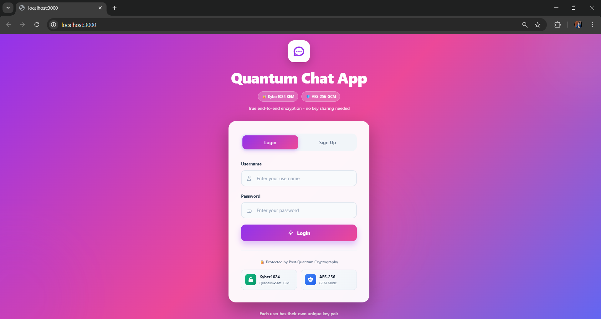
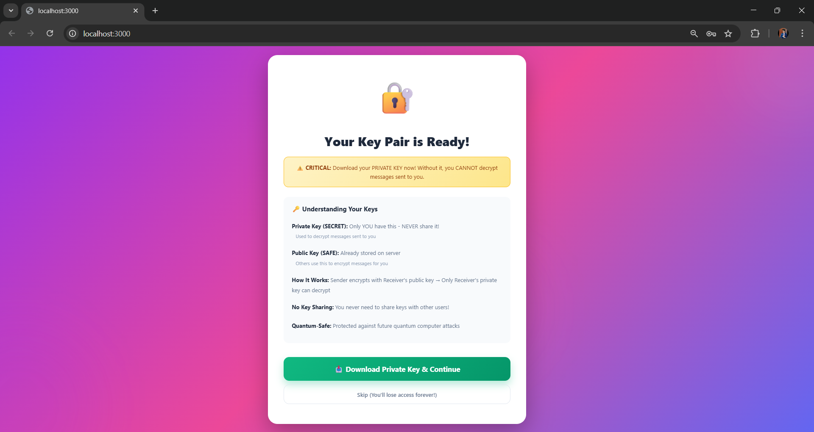
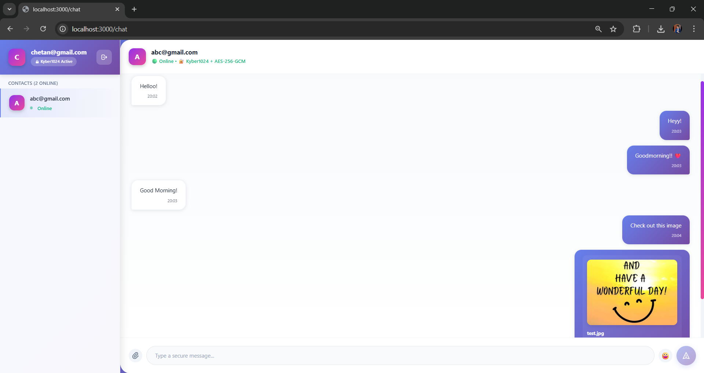

<<<<<<< HEAD
This is a [Next.js](https://nextjs.org) project bootstrapped with [`create-next-app`](https://nextjs.org/docs/app/api-reference/cli/create-next-app).

## Getting Started

First, run the development server:

```bash
npm run dev
# or
yarn dev
# or
pnpm dev
# or
bun dev
```

Open [http://localhost:3000](http://localhost:3000) with your browser to see the result.

You can start editing the page by modifying `app/page.tsx`. The page auto-updates as you edit the file.

This project uses [`next/font`](https://nextjs.org/docs/app/building-your-application/optimizing/fonts) to automatically optimize and load [Geist](https://vercel.com/font), a new font family for Vercel.

## Learn More

To learn more about Next.js, take a look at the following resources:

- [Next.js Documentation](https://nextjs.org/docs) - learn about Next.js features and API.
- [Learn Next.js](https://nextjs.org/learn) - an interactive Next.js tutorial.

You can check out [the Next.js GitHub repository](https://github.com/vercel/next.js) - your feedback and contributions are welcome!

## Deploy on Vercel

The easiest way to deploy your Next.js app is to use the [Vercel Platform](https://vercel.com/new?utm_medium=default-template&filter=next.js&utm_source=create-next-app&utm_campaign=create-next-app-readme) from the creators of Next.js.

Check out our [Next.js deployment documentation](https://nextjs.org/docs/app/building-your-application/deploying) for more details.
=======
# 🔐 Quantum Secure Chat App

<div align="center">


**A next-generation messaging platform featuring hybrid Kyber1024 KEM + AES-256-GCM encryption to withstand quantum computer attacks**

[🚀 Features](#-features) • [🛠️ Tech Stack](#️-tech-stack) • [📦 Installation](#-installation) • [🔐 Security](#-how-is-it-quantum-secure) • [📸 Screenshots](#-application-preview)

---

### ⚡ Built for the Post-Quantum Era

*Protecting your communications today and tomorrow with NIST-standardized cryptography*

</div>

---

## 🌟 Overview

**Quantum Secure Chat App** is a cutting-edge, end-to-end encrypted messaging platform designed to protect against both classical and quantum computing attacks. By combining **Kyber1024** (NIST's post-quantum key encapsulation mechanism) with **AES-256-GCM** (proven symmetric encryption), this application ensures your private conversations remain secure even as quantum computers become reality.

### ✨ Why This Matters

Current encryption methods (RSA, ECC) will be vulnerable to quantum computers. Our hybrid approach:
- ✅ Uses **Kyber1024** - NIST-approved post-quantum algorithm
- ✅ Implements **AES-256-GCM** - quantum-resistant symmetric encryption
- ✅ Provides **true end-to-end encryption** - server never sees plaintext
- ✅ Requires **no key sharing** - each user maintains their own private keys

---

## 🎯 Key Features

<table>
<tr>
<td width="50%">

### 🔒 Security Features
- **Kyber1024 KEM** - Post-quantum key exchange
- **AES-256-GCM** - Military-grade encryption
- **HKDF** - Secure session key derivation
- **Zero-Knowledge** - Server can't decrypt messages
- **Client-Side Encryption** - Keys never leave browser
- **Perfect Forward Secrecy** - Unique keys per session

</td>
<td width="50%">

### 💬 Messaging Features
- **Real-time Chat** - Instant message delivery
- **Image Sharing** - Inline preview support
- **File Attachments** - Any file type supported
- **Emoji Picker** - Express yourself
- **Online Status** - See who's available
- **Message History** - Persistent conversations
- **Multi-User Support** - Chat with anyone

</td>
</tr>
</table>

---

## 🛠️ Tech Stack

<div align="center">

| Layer | Technology | Purpose |
|-------|-----------|---------|
| **Frontend Framework** |  | React-based SSR framework |
| **UI Library** |  | Component-based UI |
| **Styling** |  | Scoped component styling |
| **Real-time Communication** |  | WebSocket for instant messaging |
| **Cryptography - PQC** |  | NIST-standardized post-quantum KEM |
| **Cryptography - Symmetric** |  | Browser-native AES-256-GCM |
| **Key Derivation** |  | HMAC-based key derivation |
| **Database** |  | Lightweight JSON database |
| **Authentication** |  | Secure session management |
| **Runtime** |  | JavaScript runtime |

</div>

### 📚 Core Dependencies
```json
{
  "next": "14.x",
  "react": "18.x",
  "socket.io": "4.x",
  "socket.io-client": "4.x",
  "lowdb": "^5.x",
  "bcryptjs": "^2.4.3",
  "jsonwebtoken": "^9.0.0",
  "cookie": "^0.6.0"
}
```

---

## 🏗️ Project Structure
```
quantum-secure-chat-app/
│
├── 📁 components/                 # Reusable React components
│   ├── Toast.js                  # Notification system with auto-dismiss
│   ├── EmojiPicker.js            # Emoji selector interface
│   └── FileUpload.js             # File attachment handler
│
├── 📁 lib/                        # Core cryptographic libraries
│   ├── pqcrypto.js               # Kyber1024 KEM implementation
│   │   ├── generateKyberKeyPair()     # Key pair generation
│   │   ├── encapsulateSecret()        # Create shared secret
│   │   └── decapsulateSecret()        # Recover shared secret
│   │
│   └── encryption.js             # Hybrid encryption utilities
│       ├── createSessionKey()         # HKDF key derivation
│       ├── encryptMessage()           # AES-256-GCM encryption
│       ├── decryptMessage()           # AES-256-GCM decryption
│       ├── encryptFile()              # File encryption
│       ├── decryptFile()              # File decryption
│       └── validatePrivateKey()       # Key format validation
│
├── 📁 pages/                      # Next.js pages & API routes
│   ├── index.js                  # Login/Signup interface
│   ├── chat.js                   # Main chat application
│   │
│   └── 📁 api/                   # Backend API endpoints
│       ├── 📁 auth/              # Authentication
│       │   ├── login.js         # User login
│       │   ├── signup.js        # User registration
│       │   ├── logout.js        # Session termination
│       │   └── me.js            # Current user info
│       │
│       ├── 📁 users/             # User management
│       │   ├── index.js         # List all users
│       │   └── public-key.js    # Public key storage/retrieval
│       │
│       ├── messages.js           # Message history retrieval
│       ├── send-message.js       # Send encrypted message
│       └── socket.js             # WebSocket handler
│
├── 📁 styles/                     # CSS styling
│   ├── globals.css               # Global styles
│   └── Chat.module.css           # Chat-specific styles
│
├── 📁 data/                       # Database (gitignored)
│   └── db.json                   # JSON-based storage
│       ├── users[]               # User accounts
│       └── messages[]            # Encrypted messages
│
├── 📁 public/                     # Static assets
│   └── favicon.ico
│
├── .gitignore                     # Git ignore rules
├── package.json                   # Project dependencies
├── next.config.js                 # Next.js configuration
└── README.md                      # This file
```

### 🔍 Key File Descriptions

| File | Purpose |
|------|---------|
| `lib/pqcrypto.js` | Implements Kyber1024 post-quantum cryptography |
| `lib/encryption.js` | AES-256-GCM encryption and HKDF key derivation |
| `pages/index.js` | User authentication and key management UI |
| `pages/chat.js` | Real-time encrypted messaging interface |
| `pages/api/socket.js` | WebSocket server for real-time communication |
| `components/Toast.js` | User notifications and feedback |

---

## 📸 Application Preview

### 🔐 Login Screen

*Beautiful gradient interface with Kyber1024 and AES-256-GCM badges*

---

### 🔑 Key Generation

*Automatic Kyber1024 key pair generation with download prompt*

---

### 💬 Chat Interface

*Clean, modern chat UI with real-time encryption status & Inline image previews with encrypted transmission**

---


## 🔐 How Is It Quantum Secure?

### The Quantum Computing Threat

Traditional encryption methods like **RSA** and **Elliptic Curve Cryptography (ECC)** rely on mathematical problems that quantum computers can solve efficiently using Shor's algorithm. This means:

❌ **RSA-2048** - Can be broken by quantum computers  
❌ **ECC (P-256)** - Vulnerable to quantum attacks  
❌ **Diffie-Hellman** - Not quantum-resistant  

### Our Quantum-Safe Solution

This application implements a **hybrid cryptographic approach** that combines post-quantum and proven classical algorithms:
```
┌─────────────────────────────────────────────────────────┐
│           HYBRID QUANTUM-SAFE ARCHITECTURE              │
├─────────────────────────────────────────────────────────┤
│                                                         │
│  ┌───────────────┐         ┌──────────────────┐       │
│  │  Kyber1024    │   +     │  AES-256-GCM     │       │
│  │  (PQ-KEM)     │         │  (Symmetric)     │       │
│  └───────────────┘         └──────────────────┘       │
│        ↓                            ↓                   │
│   Quantum-Safe              Quantum-Resistant          │
│   Key Exchange              Data Encryption            │
│                                                         │
└─────────────────────────────────────────────────────────┘
```

### 🛡️ Security Layers

#### 1️⃣ **Kyber1024 Key Encapsulation Mechanism (KEM)**

**Why Kyber?**
- ✅ **NIST-Approved** (2024) - Standardized post-quantum algorithm
- ✅ **Lattice-Based** - Resistant to both classical and quantum attacks
- ✅ **Security Level** - Equivalent to AES-256 (NIST Level 5)
- ✅ **Performance** - Fast key generation and encapsulation

**How It Works:**
```javascript
// Alice wants to send message to Bob

// 1. Alice fetches Bob's public key from server
const bobPublicKey = await fetchPublicKey('bob');

// 2. Alice encapsulates a shared secret using Bob's public key
const { sharedSecret, ciphertext } = await encapsulateSecret(bobPublicKey);
// sharedSecret: Random 32-byte secret only Alice knows
// ciphertext: Encapsulated key that only Bob can open

// 3. Bob decapsulates using his private key
const recoveredSecret = await decapsulateSecret(bobPrivateKey, ciphertext);
// recoveredSecret === sharedSecret (Bob recovered the same secret!)
```

**Quantum Security:**
- The underlying **Module-LWE** problem is believed to be hard even for quantum computers
- No known quantum algorithm can efficiently break lattice-based cryptography

#### 2️⃣ **HKDF Session Key Derivation**

**Purpose:** Convert Kyber shared secret into AES-compatible session key
```javascript
// Derive deterministic session key from shared secret
const sessionKey = await deriveSessionKey(
  sharedSecret,        // 32-byte Kyber output
  'alice-to-bob'       // Context (prevents replay attacks)
);
// Output: AES-256-GCM compatible CryptoKey
```

**Security Properties:**
- ✅ **One-way function** - Can't reverse to get shared secret
- ✅ **Context-binding** - Different for each conversation
- ✅ **Key separation** - Each message can use unique derived key

#### 3️⃣ **AES-256-GCM Encryption**

**Why AES-256-GCM?**
- ✅ **Quantum-Resistant** - Grover's algorithm only reduces to AES-128 equivalent
- ✅ **Authenticated** - GCM mode provides message authentication
- ✅ **Fast** - Hardware acceleration available in modern CPUs
- ✅ **NIST-Approved** - Federal standard (FIPS 197)

**Encryption Process:**
```javascript
// Encrypt message with session key
const { ciphertext, iv } = await encryptMessage(
  "Hello, this is secret!",
  sessionKey
);

// Send to recipient
send({
  encapsulatedKey: ciphertext_kyber,  // Kyber ciphertext
  ciphertext: ciphertext_aes,         // AES ciphertext
  iv: initialization_vector            // Random IV
});
```

**Quantum Security:**
- Grover's algorithm can search AES-256 keyspace in 2^128 operations
- Still requires impractical amount of quantum resources
- Considered safe for decades

---

## 🎯 Security Guarantees

### ✅ What This Protects Against

| Attack Type | Protection Mechanism | Status |
|-------------|---------------------|---------|
| **Quantum Computer Attacks** | Kyber1024 lattice-based crypto | ✅ Protected |
| **Man-in-the-Middle** | Public key infrastructure + authentication | ✅ Protected |
| **Server Compromise** | End-to-end encryption, client-side keys | ✅ Protected |
| **Message Tampering** | AES-GCM authenticated encryption | ✅ Protected |
| **Replay Attacks** | Unique IVs, timestamps, context-bound keys | ✅ Protected |
| **Brute Force** | AES-256 (2^256 keyspace) | ✅ Protected |
| **Known-Plaintext** | Modern authenticated encryption | ✅ Protected |

### 🔐 Cryptographic Standards Compliance

- ✅ **NIST Post-Quantum Cryptography** - Kyber (2024 standard)
- ✅ **FIPS 197** - AES encryption
- ✅ **RFC 5869** - HKDF key derivation
- ✅ **NIST SP 800-38D** - GCM mode operation

---

## 🚀 How It Works

### 1️⃣ **User Registration**
```bash
User clicks "Sign Up" 
    ↓
Generate Kyber1024 key pair (3-5 seconds)
    ├── Private Key: 3168 bytes (stays with user)
    └── Public Key: 1568 bytes (uploaded to server)
    ↓
Download private_key.txt file
    ↓
Store securely (password manager, encrypted drive)
```

### 2️⃣ **User Login**
```bash
User enters credentials
    ↓
Upload private key file
    ↓
Validate key format (length, structure)
    ↓
Store in sessionStorage (cleared on logout)
    ↓
Access chat interface
```

### 3️⃣ **Sending a Message**
```javascript
// Client-side process
1. User types: "Hello World"
2. Fetch recipient's public key from server
3. Kyber KEM: Generate shared secret
4. HKDF: Derive AES session key
5. AES-256-GCM: Encrypt "Hello World"
6. Send: {encapsulatedKey, ciphertext, iv}
7. Server stores encrypted data (cannot decrypt!)
```

### 4️⃣ **Receiving a Message**
```javascript
// Client-side process
1. Receive: {encapsulatedKey, ciphertext, iv, from: "alice"}
2. Kyber Decapsulate: Use private key → shared secret
3. HKDF: Derive same session key
4. AES-256-GCM: Decrypt ciphertext
5. Display: "Hello World"
```

### 5️⃣ **File Sharing**
```javascript
// Same process as text messages
1. Read file as ArrayBuffer
2. Encrypt file data with AES-256-GCM
3. Send encrypted file with Kyber-encapsulated key
4. Recipient decrypts and can download/view
5. Images show inline preview after decryption
```

---

## 📦 Installation

### Prerequisites
```bash
✅ Node.js 18+ and npm
✅ Modern browser (Chrome 90+, Firefox 88+, Safari 14+)
✅ Git
```

### Quick Start
```bash
# 1. Clone repository
git clone https://github.com/chetanmeshram10/Quantum-Secure-Chat-App.git
cd Quantum-Secure-Chat-App

# 2. Install dependencies
npm install

# 3. Start development server
npm run dev

# 4. Open browser
# Navigate to http://localhost:3000
```

### Production Build
```bash
# Build for production
npm run build

# Start production server
npm start
```

---

## 🧪 Testing Guide

### Test Scenario 1: Two-User Encrypted Chat
```bash
# Terminal
npm run dev

# Browser 1 (Normal)
1. Go to http://localhost:3000
2. Sign up as "alice"
3. Download alice_private_key.txt
4. Enter chat

# Browser 2 (Incognito)
1. Go to http://localhost:3000
2. Sign up as "bob"
3. Download bob_private_key.txt
4. Enter chat

# Test
- Alice selects Bob and sends: "Hi Bob! 👋"
- Bob receives and sees decrypted message
- Both users have their OWN keys (no sharing!)
```

### Test Scenario 2: Image Sharing
```bash
1. Upload a JPG/PNG image
2. Verify image preview shows inline
3. Click to view full size
4. Recipient can download encrypted image
5. Verify file integrity (compare checksums)
```

### Test Scenario 3: Security Validation
```bash
# Check encryption in DevTools
1. Open DevTools (F12) → Network tab
2. Send a message
3. Check POST /api/send-message payload
4. Verify: Only ciphertext visible (no plaintext!)

# Test wrong key
1. Try to login with someone else's key file
2. Should reject: "Key file is for 'alice', not 'bob'"
```

---

## 🔧 Configuration

### Environment Variables

Create `.env.local`:
```bash
# Server
PORT=3000

# JWT Secret (change in production!)
JWT_SECRET=your-super-secret-jwt-key-change-this

# Session
SESSION_MAX_AGE=86400000  # 24 hours
```

### Database Location
```bash
# Default
data/db.json

# Change in code if needed
const dbPath = path.join(process.cwd(), 'data', 'db.json');
```

---

## 🛡️ Best Practices

### For Users

| ✅ Do | ❌ Don't |
|-------|----------|
| Download and backup your private key | Share your private key with anyone |
| Store key in password manager | Email your key or upload to cloud unencrypted |
| Use strong passwords (12+ chars) | Reuse passwords across services |
| Logout from shared devices | Leave sessions open on public computers |
| Verify online status before sending | Assume messages are delivered instantly if user offline |


---

## 👨‍💻 Author

## **Chetan Meshram**

**Mtech IT IIITA Student | Blockchain & Cryptography Enthusiast**

🔗 GitHub: https://github.com/chetanmeshram10

---

## ⭐ Support
If you found this project useful:
- ⭐ Star the repository
- 🍴 Fork it
- 📢 Share
>>>>>>> 80b424eef1d4a137c24b2b7de0819b0a4b76ec4a
